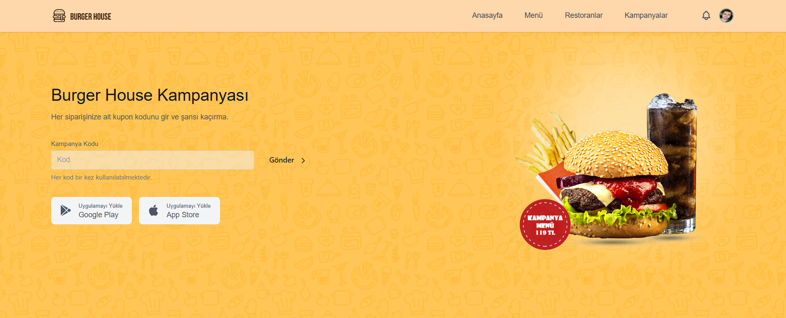
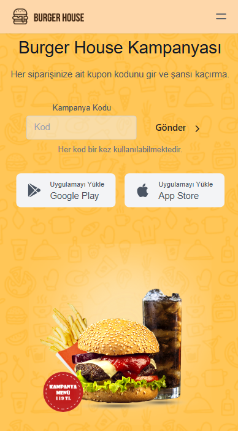

# React & Tailwind

# Hamburger Firması Sayfa Tasarımı
<a href="https://navbar-tailwind-beta.vercel.app/" target="_blank">Ön İzleme</a>

Masaüstü Görünüm


Mobil Görünüm <br />


## Getting Started

First, run the development server:

```bash
npm run dev
# or
yarn dev
# or
pnpm dev
# or
bun dev
```

Open [http://localhost:3000](http://localhost:3000) with your browser to see the result.

You can start editing the page by modifying `app/page.js`. The page auto-updates as you edit the file.

